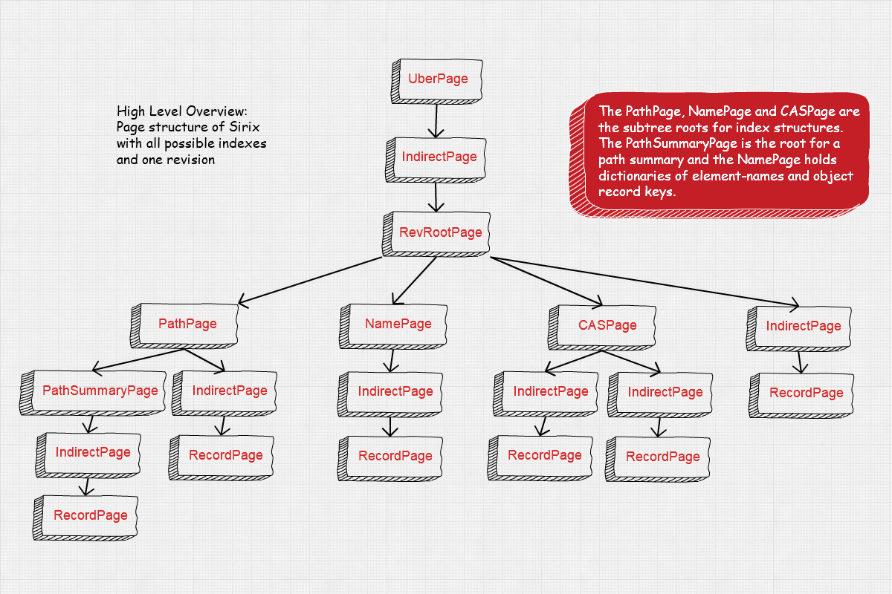
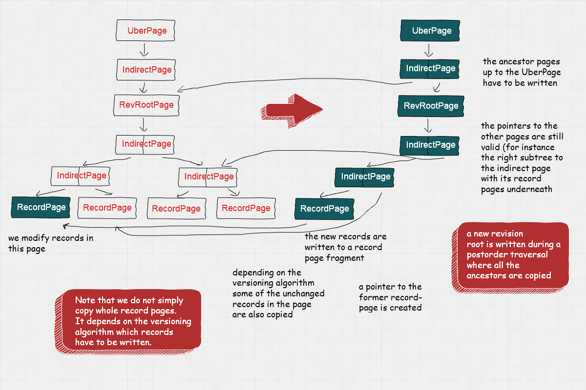

## Introduction
Sirix is a temporal database system and never overwrites data. Let's first define what a temporal database system is all about.

It is a term used to describe, that a system is capable of retrieving past states of your data. Typically a temporal database stores both valid time, how long a fact is true in the real world as well as transaction time, when the data actually is committed to the database.

Questions such as: Give me last month’s history of the Dollar-Pound Euro exchange rate. What was the customers address on July 12th in 2015 as it was recorded back in the day? Did they move or did we correct an error? Did we have errors in the database, which were corrected later on?

Let’s turn or focus to the question why historical data hasn’t been retained in the past and how new storage advances in recent years made it possible, to build sophisticated solutions to help answer these questions without the hurdle, state-of-the-art systems bring.

## Advantages and disadvantages of flash drives as for instance SSDs
As Marc Kramis points out in his paper “Growing Persistent Trees into the 21st Century”:

> The switch to flash drives keenly motivates to shift from the “current state’’ paradigm towards remembering the evolutionary steps leading to this state.

The main insight is that flash drives as for instance SSDs, which are common nowadays have zero seek time while not being able to do in-place modifications of the data. Flash drives are organized into pages and blocks. Due to their characteristics they are able to read data on a fine-granular page-level, but can only erase data at the coarser block-level. Blocks first have to be erased, before they can be updated. Thus, updated data first is written to another place. A garbage collector marks the data, which has been rewritten to the new place as erased at the old block, such that new data can be stored in the future. Furthermore index-structures are updated.

Evolution of state through fine grained modifications
Furthermore Marc points out, that small modifications, because of clustering requirements due to slow random reads of traditionally mechanical disk head seek times, usually involves writing not only the modified data, but also all other records in the modified page as well as a number of pages with unmodified data. This clearly is an undesired effect.

## How we built an Open Source storage system based on these observations from scratch

Sirix stores per revision and per page-deltas. Due to zero seek time of flash drives we do not have to cluster data. Sirix only ever clusters data during transaction commits. It is based on an append-only storage. Data is never modified in-place.

Instead, it is copied and appended to a file in a post-order traversal of the internal tree-structure in batches once a transaction commits.

The page-structure for one revision is depicted in the following figure:

{: style="max-width: 100%; height: auto; margin: 0em"}

The `UberPage` is the main entry point. It contains header information about the configuration of the resource as well as a reference to an `IndirectPage`. A reference contains the offset of the IndirectPage in the data-file or the transaction-intent log and an in-memory pointer. IndirectPages are used to increase the fanout of the tree. We currently store 512 references in the `IndirectPage` to either another layer of indirect pages or the data pages, either a `RevisionRootPage` or a `RecordPage`. A new level of indirect pages is added whenever we run out of the number of records we can store in the leaf pages (either revisions or records), which are referenced by the `IndirectPage`s. The height of the current subtree, that is the number of levels of indirect pages is always stored in the respective subtree-root page.

We borrowed the ideas from the filesystem ZFS and hash-array based tries as we also store checksums in parent database-pages/page-fragments, which in turn form a self-validating merkle-tree.

As IndirectPages may have many `null`-pointers we use a bitset to keep track of which array indices are really set and thus are able to store a compact array or list in-memory.

The `RevisionRootPage` is the main entry point to a revision. It stores the author-ID, an optional commit-message and a timestamp in the form of the unix epoch (milliseconds since 1970). Furthermore it stores a reference to a `PathPage`, a `CASPage` (if it exists), a `NamePage` and an `IndirectPage`. The indirect page is the entry point to the data stored in the leaf `RecordPage`s. The `PathPage` has a reference to a `PathSummary` page, which in its subtree stores a lightweight path summary in the linked `RecordPage`s. Other references to indirect pages are added, once path indexes are created. Each path index has a unique number which also denotes which reference to use. The `NamePage` contains dictionaries of frequently used names (element-names/attribute-names in XML or object key names in JSON), which are referenced from the records. Furthermore `IndirectPage`s are created once Name-indexes are created, whereas each indirect page then is the root to the index. Just like CAS (content-and-structure) and path-indexes an AVL-tree is stored in the record-pages. `CASPages` are the subtree root to these so called content-and-structure indexes. They are a hybrid consisting of path class definitions and typed content, for instance `/book/published[xs:dateTime]` indexes the path `/book/published` and the content as `xs:dateTime`.

The right subtree of the `RevisionRootPage` started by the `IndirectPage` actually is the main entry point to our data stored in the leaf nodes, the `RecordPage`s once again.

To support fast access to a RevisionRootPage we store a second file with just the offsets to specific revisions in a revisions-file, which is read into main-memory on startup.

In order to support the efficient storage/retrieval of small and large records we introduced `OverflowPage`s for large records, which only have to be read, if they are directly selected, as we usually store byte-arrays and once deserialized the reconstructed instances in in-memory maps.

The next figure depicts what happens during a transaction-commit.

{: style="max-width: 100%; height: auto; margin: 0em"}

We assume that we have inserted/updated/deleted a record in the leftmost RecordPage. What happens is that depending on the versioning algorithm the modified record as well as probably some other records of the page are copied to a new page fragment. First, all changes are stored in an in-memory transaction (intent) log, which can be persisted, if needed. Second, during a transaction commit the page-structure of the current `RevisionRootPage` is serialized in a postorder traversal. All changed `RecordPage`s are written to disk / a flash drive, from the left most `IndirectPage` which has been updated. Then the indirect page is written with updated references to the new persistent locations of the record page fragments. We also store checksums in the parent pointers as in ZFS, such that the storage in the future is able to detect data corruption and heal itself, once we partition and especially replicate the data. The whole page-structure is serialized in this manner. We also want to store an encryption key in the references in the future, to support encryption at rest. 

Note, that we have to update the ancestor path of each changed `RecordPage`. However note, that storing indirect pages as well as the `RevisionRootPage`/`CASPage`,`PathSummaryPage` and the `PathPage` is cheap. We currently store copies of the `NamePage`s, but in the future might also version these according to the chosen versioning algorithm, just like `RecordPage`s, just we do not need to copy the whole dictionaries and save storage costs thereof. Each reference, which doesn't point to a new page or page-fragment is left unchanged. Thus, unchanged pages (which are also not on the ancestor-path of changed pages) are simply referenced at their respective position in the former revision and never rewritten. 

One of the dictinctive features of Sirix is that we are versioning the `RecordPage`s and not just copy all records in the page, even if only a single record has been modified. The new record page fragment always contains a reference to the former version. Thus, our versioning algorithms are able to dereference a fixed predefined number of page-fragments at max to reconstruct a `RecordPage` in-memory.

We currently support one read/write-transaction concurrent to N-read only transactions. Thus, our architecture supports concurrency very well (note the difference between concurrency and parallel computations, the former simply is a prerequisite for the latter). If we ever want to allow concurrent writes to the same resource we could introduce a form of serializable snapshot isolation (which we think is not feasable for tree-structured data as XML- and JSON, at least if we store hashes of the nodes and the number of descendants).

### Versioning algorithms for storing and retrieving record-level snapshots

As most database system we store at most a fixed number of records, that is the actual data per database-page (currently 512 records at most). The records themselves are of variable size. Overlong records, which exceed a predefined length in bytes are stored in additional overflow pages and only referenced in the record-pages.

We implemented a number of versioning strategies best known from backup systems for copy-on-write operations of record-pages. Namely we either copy

- the full record-pages, that is any record in the page (full)
- only the changed records in a record-page regarding the former version (incremental)
- only the changed records in a record-page since a full page dump (differential)

Incremental-versioning is the other extreme and write-performance is best, as it stores the optimum (only changed records), but on the other hand reconstructing a page needs intermittent full snapshots of pages, such that the performance doesn’t deteriorate with each new revision of the page as the number of increments increases with each new version.

Differential-versioning tries to balance reads and writes a bit better, but is still not optimal. Each time records in a page are modified a new page is written, with all changed records since a past full dump of the page. This means that only ever two revisions of the page-fragment have to be read to reconstruct a record-page. However write-performance also deteriorates with each new revision of the page.

Incremental versioning in regards to write performance, due to the requirement of intermittent full dumps of the page results in write-peaks. Differential versioning also suffers from a similar problem. Without an intermittent full dump a lot of data would have to be duplicated on each new write.

Marc Kramis came up with the idea of a novel sliding snapshot algorithm, which balances read/write-performance to circumvent any write-peaks.

The algorithm makes use of a sliding windows. First, any changed record must be stored, second any record, which is older than a predefined length N of the window and which has not been changed during these N-revisions. Only these N-revisions at max have to be read. The fetching of the page-fragments could be done in parallel or we simply stop once the full-page has been reconstructed starting with the most recent revision. Probably the best high level overview of the algorithm can be found in Marc's Thesis: [Evolutionary Tree-Structured Storage: Concepts, Interfaces, and Applications](http://kops.uni-konstanz.de/handle/123456789/27695)

Once we made sure our storage system scaled linear for fetching old-revisions as well as the most recent revision and logarithmic for fetching and storing single records as well as whole revisions we focused our attention to upper layers.
