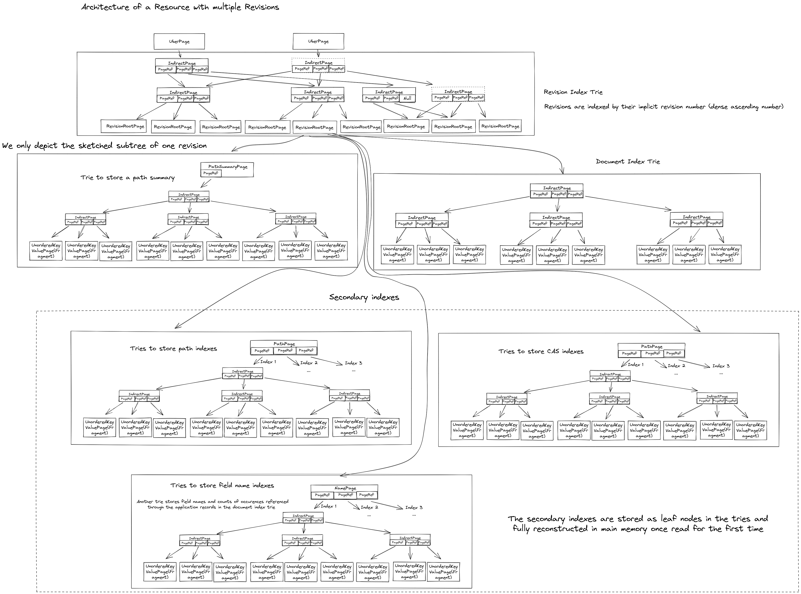

[Edit document on Github](https://github.com/sirixdb/sirixdb.github.io/edit/master/concepts.md)

## Introduction
SirixDB is a temporal, tamper proof append-only database system and never overwrites data. Every time you're committing a transaction, SirixDB creates a new lightweight snapshot. It uses a log-structured copy-on-write approach, whereas versioning takes place at the page- as well as node-level. Let's first define what a temporal database system is all about.

A temporal database is capable of retrieving past states. Typically it stores the transaction time; that is the time a transaction commits data. If the valid time is also stored, that is when a fact is true in the real world, we have a bitemporal relation, which is two time axes.

SirixDB can help answer questions such as the following: Give me last month's history of the Dollar-Pound Euro exchange rate. What was the customer's address on July 12th in 2015 as it was recorded back in the day? Did they move or did someone correct an error? Did we have errors in the database, which were corrected later on?

Let's turn our focus towards the question of why historical data has not been retained in the past. We postulate that new storage advances in recent years present possibilities, to build sophisticated solutions to help answer those questions without the hurdle, state-of-the-art systems bring.

## Advantages and disadvantages of flash drives, for instance, SSDs
As Marc Kramis points out in his paper "Growing Persistent Trees into the 21st Century":

> The switch to flash drives keenly motivates to shift from the "current state" paradigm towards remembering the evolutionary steps leading to this state.

The main insight is that flash drives as SSDs, which are common nowadays have zero seek time while not being able to do in-place modifications of the data. Flash drives are organized into pages and blocks. Due to their characteristics, they can read data on a fine-granular page-level, but can only erase data at the coarser block-level. Furthermore, blocks first have to be erased before they can be updated. Thus, whenever a flash drive updates data, it is written to another place. A garbage collector marks the data, which has been rewritten to the new place as erased at the previous block location. The flash drive can store new data in the future at the former location. Metadata to find the data at the new location is updated.

### Evolution of state through fine-grained modifications

{: style="max-width: 80%; height: auto; margin: 0em"}

Furthermore, Marc points out that those small modifications usually involve writing not only the modified data but also all other records on the modified page. This is an undesired effect. Traditional spinning disks require clustering due to slow random reads of traditionally mechanical disk head seek times. 

Instead, from a storage point of view, it is desirable only to store the changes. As we'll see, it boils down to a trade-off between read and write performance. On the one hand, a page needs to be reconstructed in-memory from scattered incremental changes. On the other hand, a storage system probably has to store more records than necessarily have changed to fast track the reconstruction of pages in memory.

## How we built an Open Source storage system based on these observations from scratch
SirixDB stores per revision and page deltas. Due to zero seek time of flash drives, SirixDB does not have to cluster data. It only ever clusters data during transaction commits. Data is written sequentially to log-structured storage. It is never modified in-place.

Database pages are copied to memory, updated and synced to a file in batches. When a transaction commits, SirixDB flushes pages to persistent storage during a postorder traversal of the internal tree-structure.

The page-structure is heavily inspired by the operating system ZFS. We used some of the ideas to store and version data on a sub-file level. We'll see that Marc Kramis came up with a novel sliding snapshot algorithm to version record pages, based on observed shortcomings of versioning approaches from backup systems.

### Page structure
SirixDB stores `databases`, that is, collections of `resources`. Resources are the equivalent unit to relations/tables in relational database systems. A resource typically is a JSON or XML file stored in SirixDBs binary tree-encoding.

The page-structure for one revision of a resource is depicted in the following figure:

{: style="max-width: 30%; width: 700px; height: auto; margin: 0em"}

**Each node and revision in SirixDB is referenced by a unique, stable identifier.** First, SirixDB has to find the revision by its revision number traversing a tree of indirect-pages. Addressing nodes is done in the same manner.

The pages SirixDB stores are:

UberPage
: The `UberPage` is the main entry point. It contains header information about the configuration of the resource as well as a reference to an `IndirectPage`. The reference contains the offset of the IndirectPage in the data-file or the transaction-intent log and an in-memory pointer. SirixDB always writes the `UberPage` as the last page in an atomic operation to persistent storage. Thus, even in case the transaction fails, we always have a valid, consistent state of the storage.

IndirectPage
: IndirectPages are used to increase the fanout of the tree.  SirixDB uses these pages to be able to store and retrieve a large number of records while only ever having to read a predefined number of pages.  We currently store 512 references in the `IndirectPage` to either another layer of indirect pages or the data pages, either a `RevisionRootPage` or a `RecordPage`. SirixDB adds a new level of indirect pages whenever it runs out of the number of records it can address in the leaf pages. It stores the height of the current subtree that is the number of levels of indirect pages in the respective subtree-root page. We borrowed the ideas from the filesystem ZFS and hash-array based tries as we also store checksums in parent database-pages/page-fragments, which in turn form a self-validating merkle-tree. As IndirectPages potentially may have many `null`-pointers, SirixDB uses a bitset to keep track of which array indices contain references. Thus, it can store a compact array or list in-memory.

RevisionRootPage
: The `RevisionRootPage` is the main entry point to a revision. It stores the author-ID, an optional commit-message and a timestamp in the form of the unix epoch (milliseconds since 1970). Furthermore it stores a reference to a `PathPage`, a `CASPage` (if it exists), a `NamePage` and an `IndirectPage`. The indirect page is the entry point to the data stored in the leaf `RecordPage`s. The right subtree of the `RevisionRootPage` started by the `IndirectPage` actually is the main entry point to our data stored in the leaf nodes, the `RecordPage`s once again.
To support fast access to a `RevisionRootPage`, SirixDB stores a second file with just the offsets to specific revisions in a revisions-file,  which is read into main-memory on startup.

PathPage
: The `PathPage` has references to `IndirectPage`s, whereas each of the indirect pages is the root entry point to a user-defined path index. A unique index ID is also the reference offset in the path page to retrieve the respective path index/`IndirectPage` subtree root. SirixDB adds references to indirect pages, once a user creates path indexes. SirixDB stores a balanced binary search tree (RedBlack) for each index in the leaf pages (the `RecordPage`s), which are referenced by the indirect pages. The index contains path nodes as keys as well as an array of record-identifiers in the values. Furthermore, a path page contains a reference to a `PathSummary` page.

PathSummaryPage
: A path summary page has a reference to an indirect page, which is the main entry point to retrieve and restore a lightweight path summary in the leaves of the tree, the `RecordPage`s. In this case, the record pages store the path nodes.

NamePage
: The `NamePage` contains dictionaries of frequently used names, that is element-/attribute-names and namespaces in XML or object key names in JSON. The nodes store the dictionary keys. Furthermore, once a user creates name-indexes, SirixDB creates `IndirectPage`s. Each indirect page is the root of an index. Just as described for the path page the indexes are stored in the leaf record pages in RedBlack-trees.

CASPage
: A `CASPage` is the main entry point to store and retrieve CAS- (content-and-structure) indexes. They are a hybrid consisting of path class definitions and typed content. `/book/published[xs:dateTime]` for instance indexes the path `/book/published` and the content as `xs:dateTime`. The indexes are as always stored in RedBlack-trees.

RecordPage/UnorderedKeyValuePage
: `UnorderedKeyValuePage`s store the actual data. Currently, SirixDB stores 512 records in a record page. The `IndirectPage`, which has a page reference to this record page, might also have up to `N` page references to previous revisions of this page called page fragments. This pointer is crucial for our versioning algorithms, which have to retrieve several record pages (or record page fragments) to reconstruct a record page in-memory. Furthermore, records, which exceed a predefined size, are stored in so-called `OverflowPage`s and referenced in a record page.

OverflowPage
: `OverflowPage`s are used to store records, which exceeds a predefined size in bytes. When a transaction reads a record, SirixDB reconstructs the record page in-memory.

However, potentially only a small fraction of records in the page have to be retrieved and reconstructed from byte-arrays in-memory for reads. SirixDB can delay this reconstruction until a transaction reads the overlong record.

### Transaction commit

The next figure depicts what happens during a transaction-commit.

{: style="max-width: 100%; height: auto; margin: 0em"}

We assume that a read-write transaction modifies a record in the leftmost *RecordPage*. Depending on the versioning algorithm used by SirixDB, the modified record, as well as probably some other records of the page, are copied to a new page fragment. First, SirixDB stores all changes in an in-memory transaction (intent) log. Second, during a transaction commit, the page-structure of the current *RevisionRootPage* is serialized in a postorder traversal.

All changed *RecordPages* are written to persistent storage, starting with the leftmost. If other changed record pages exist underneath an indirect page, SirixDB serializes these before the *IndirectPage*, which points to the updated record pages. Then the *IndirectPage* which points to the updated revision root page is written. The indirect pages are written with updated references to the new persistent locations of the record pages.

SirixDB also stores checksums in the parent pointers as in ZFS. Thus, the storage engine in the future will be able to detect data corruption and heal itself, once we partition and replicate the data. SirixDB serializes the whole page-structure in this manner. We also intend to store an encryption key in the references in the future, to support encryption at rest.

Note that SirixDB has to update the ancestor path of each changed *RecordPage*. However, storing indirect pages as well as the *RevisionRootPage*, *CASPage*, *PathSummaryPage*, and the *PathPage* is cheap. We currently store copies of the *NamePages*, but in the future might also version these according to the chosen versioning algorithm. Thus, we do not need to copy the whole dictionaries and save storage costs thereof. Each reference, which doesn't point to a new page or page-fragment, is left unchanged. Thus, unchanged pages (which are also not on the ancestor-path of changed pages) are referenced at their respective position in the previous revision and never rewritten.

### Versioning at the page-level

One of the most distinctive features of SirixDB is that it versions the *RecordPages*. It doesn't merely copy all records of the page, even if a transaction only modifies a single record. The new record page fragment always contains a reference to the previous version. Thus, the versioning algorithms can dereference a fixed predefined number of page-fragments at maximum to reconstruct a RecordPage in-memory.

**A sliding snapshot algorithm used to version record pages can avoid read and write peaks. The algorithm avoids intermittent full-page snapshots, which are otherwise needed during incremental or differential page-versioning to fast-track its reconstruction.**

### Versioning algorithms for storing and retrieving page snapshots

SirixDB stores at most a fixed number of records. That is the actual data per database-page (currently limited to 512 records). The records themselves are of variable size. Overlong records, which exceed a predefined length in bytes, are stored in additional overflow pages. SirixDB stores references to these pages in the record pages.

SirixDB implements several versioning strategies best known from backup systems for copy-on-write operations of record-pages. Namely it either copies

- the full record-page that is any record in the page (full)
- only the changed records in a record-page regarding the former version (incremental)
- only the changed records in a record-page since a full-page dump (differential)

Incremental-versioning is one extreme. Write performance is best, as it stores the optimum (only changed records). On the other hand, reconstructing a page needs intermittent full snapshots of pages. Otherwise, performance deteriorates with each new revision of the page as the number of increments increases with each new version.

Differential-versioning tries to balance reads and writes a bit better, but is still not optimal. A system, implementing a differential versioning strategy has to write all changed records since a past full dump of the page. Thus, only ever two revisions of the page-fragment have to be read to reconstruct a record-page. However, write-performance also deteriorates with each new revision of the page.

Write peaks occur both during incremental versioning, due to the requirement of intermittent full dumps of the page. Differential versioning also suffers from a similar problem. Without an intermittent full dump, a system using differential versioning has to duplicate vast amounts of data during each new write.

Marc Kramis came up with the idea of a novel sliding snapshot algorithm, which balances read/write-performance to circumvent any write-peaks.

The algorithm makes use of a sliding window. First, any changed record must be written during a commit. Second, any record, which is older than a predefined length N of the window and which has not been changed during these N-revisions must be written, too. Only these N-revisions at max have to be read. Fetching of the page-fragments can be done in parallel or linear. In the latter case the page fragments are read starting with the most recent revision. The algorithm stops once the full-page has been reconstructed. You can find the best high-level overview of the algorithm in Marc's Thesis: [Evolutionary Tree-Structured Storage: Concepts, Interfaces, and Applications](http://kops.uni-konstanz.de/handle/123456789/27695)
