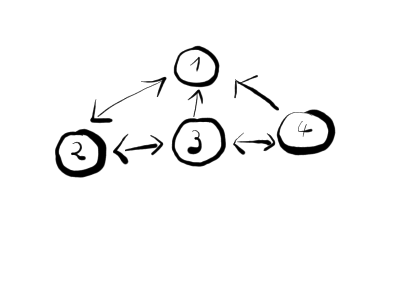

[Edit document on Github](https://github.com/sirixdb/sirixdb.github.io/edit/master/transactional-cursor-api.md)

## Maven artifacts

First, you have to get the dependency on our SirixDB core project. At this stage of development please use the latest SNAPSHOT artifacts from the OSS snapshot repository. Just add the following repository section to your POM file:

```xml
<repository>
  <id>sonatype-nexus-snapshots</id>
  <name>Sonatype Nexus Snapshots</name>
  <url>https://oss.sonatype.org/content/repositories/snapshots</url>
  <releases>
    <enabled>false</enabled>
  </releases>
  <snapshots>
    <enabled>true</enabled>
  </snapshots>
</repository>```

Or for Gradle:
```gradle
apply plugin: 'java'
apply plugin: 'maven'

repositories {
    maven {
          url "https://oss.sonatype.org/content/repositories/snapshot"
    }
}
```

However, if you prefer, we just released version 0.9.3 of SirixDB in Maven Central. Currently, the following SNAPSHOT-artifacts are available. Make sure that snapshots are getting updated with newer versions in your IDE.

Core project:

```xml
<dependency>
  <groupId>io.sirix</groupId>
  <artifactId>sirix-core</artifactId>
  <version>0.9.4-SNAPSHOT</version>
</dependency>
```

To add the dependency in Gradle:
```gradle
dependencies {
  compile 'io.sirix:sirix-core:0.9.4-SNAPSHOT'
}
```

** You have to use Java 13 and Maven >= 3.6.2 **

## Article Describing the JSON Transactional Cursor API
You can find an article about this API regarding only JSON stuff on [Baeldung](https://www.baeldung.com/sirix).

## Tree-Encoding in SirixDB
The encoding of the underlying tree structure of both XML and JSON documents in SirixDB uses a pointer-based approach.

SirixDB doesn't use range-encodings (not update-friendly) or hierarchical labels (B+-tree index-structure traversal might be too expensive). However, we can specify that SirixDB stores hierarchical labels (DeweyIDs) for XML-resources to provide fast document order determination.

Instead of the aforementioned encodings, a node in SirixDB references other nodes by a firstChild/leftSibling/rightSibling/parentNodeKey/nodeKey encoding. Think of it as a persistent DOM:

<div class="img_container">

</div>

The numbers in the figure are auto-generated unique, stable node-IDs or node-keys generated with a simple sequential number generator.

Every structural node might have a first child, a left sibling, a right sibling, and a parent node.

Namespaces and attributes are the only non-structural nodes in XML resources. They have a parent pointer. If the transactional cursor points to an element node, you can reference these nodes through special moveToAttribute and moveToNamespace.

In the JSON-to-tree mapping, however, every node is a structural node. To support fine granular versioning of nodes and to be able to reuse the axis-implementations, SirixDB uses the same encoding for JSON resources as we've seen.

Thus we'll introduce a unique API, which we're going to use for both traversing and updating XML and JSON resource with only subtle differences.

**Note that the binary JSON-format in SirixDB allows ordered, duplicate object record keys. Upper layers, however, may store object records in a hash map, thus not keeping track of the order nor supporting duplicate record keys.**

## Create a Database With a Single Resource

### Create an XML Database and Resource
First, we want to show how to create a database with a single resource:

```java
// XML-file to import.
final var pathToXmlFile = Paths.get("xmlFile");

// Path to create the database at.
final var databaseFile = Paths.get("database");

// Create a new lightweight database structure.
Databases.createXmlDatabase(new DatabaseConfiguration(databaseFile));

// Open the database.
try (final var database = Databases.openXmlDatabase(databaseFile)) {
  // Create a first resource without text-value compression but with DeweyIDs which are
  // hierarchical node labels.
  database.createResource(
    ResourceConfiguration.builder("resource")
                         .useTextCompression(false)
                         .useDeweyIDs(true)
                         .versioningApproach(VersioningType.DIFFERENTIAL)
                         .revisionsToRestore(3)
                         .buildPathSummary(true)
                         .build());

  try (// Open a resource manager.
       final var manager = database.openResourceManager("resource");
       // Open only write transaction on the resource (transaction provides
       // a cursor for navigation through moveToX-methods).
       final var wtx = manager.beginNodeTrx();
       final var fis = new FileInputStream(pathToXmlFile.toFile())) {
       
       // Import an XML document.
       wtx.insertSubtreeAsFirstChild(XmlShredder.createFileReader(fis));

       // Commit and persist the changes.
       wtx.commit();
  }
}
```

The resource is built with text node-compression disabled and so-called DeweyIDs enabled. DeweyIDs are a form of hierarchical node labels for instance used by an XQuery processor to quickly determine document-order (which node comes first during a preorder traversal).

In the above example, we show how you can specify a versioning approach that SirixDB is going to use to version data-pages. Default is the sliding snapshot algorithm, which is the best option in most cases. However, we want to demonstrate the most commonly used builder options.

The `revisionsToRestore`-method is used in conjunction with the versioning approach. When you specify the differential or incremental versioning approach it denotes after how many revisions SirixDB serializes a new full-page snapshot. In case you specify the sliding snapshot, it is the windows-size. It has no effect when you use full-versioning.

The method `buildPathSummary` specifies if SirixDB should build and automatically keep a summary of all paths up-to-date. We omit other builder options here for brevity as defining a byte handler pipeline, which is used to serialize/deserialize page-fragments.

### Create a JSON Database and Resource

In order to import a single JSON file you can almost use the same API:

```java
// JSON-file to import.
final var pathToJsonFile = Paths.get("jsonFile");

// Create database configuration.
final var databaseFile = Paths.get("database");

// Create a new lightweight database structure.
Databases.createJsonDatabase(new DatabaseConfiguration(databaseFile));

// Open the database.
try (final var database = Databases.openJsonDatabase(databaseFile)) {
  // Create a first resource with all standard builder settings set.
  database.createResource(ResourceConfiguration.builder("resource").build());

  try (// Open a resource manager.
       final var manager = database.openResourceManager("resource");
       // Open only write transaction on the resource (transaction provides
       // a cursor for navigation through moveToX-methods).
       final var wtx = manager.beginNodeTrx();
       final var fis = new FileInputStream(pathToJsonFile.toFile())) {
       
       // Import a JSON-document.
       wtx.insertSubtreeAsFirstChild(JsonShredder.createFileReader(fis));

       // Commit and persist the changes.
       wtx.commit();
  }
}
```
## Open a Resource in a Database and Iterate

### Preorder Navigation in an XML resource

Now, that you've have imported the first resource into SirixDB, you can reuse the read-write transaction after issuing the commit. Alternatively, you can open the resource manager again and start a new read-only transaction.

```java
// Open the database.
try (final var database = Databases.openXmlDatabase(databaseFile);
     final var manager = database.openResourceManager("resource");
     // Now open a read-only transaction again.
     final var rtx = manager.beginNodeReadOnlyTrx()) {
    
  // Use the descendant axis to iterate over all structural descendant nodes
  // (each node with the exception of namespace- and attribute-nodes) in
  // pre-order (depth-first).
  new DescendantAxis(rtx, IncludeSelf.YES).forEach((unused) -> {
    // The transaction-cursor is moved to each structural node
    // (all nodes, except for namespace- and attributes in preorder).
    switch (rtx.getKind()) {
      case ELEMENT:
        // In order to process namespace-nodes we could do the following and
        // log the full qualified name of each node.
        for (int i = 0, nspCount = rtx.getNamespaceCount(); i < nspCount; i++) {
          rtx.moveToNamespace(i);
          LOGGER.info(rtx.getName());
          rtx.moveToParent();
        }

        // In order to process attribute-nodes we could do the following and
        // log the full qualified name of each node. 
        for (int i = 0, attrCount = rtx.getAttributeCount(); i < attrCount; i++) {
          rtx.moveToAttribute(i);
          LOGGER.info("Attribute name:" + rtx.getName());
          LOGGER.info("Attribute value:" + rtx.getValue());
          rtx.moveToParent();
        }
        break;
        
        LOGGER.info(rtx.getDescendantCount());
        LOGGER.info(rtx.getChildCount());
        /* 
         * Hash of a node, build bottom up for all nodes (depends on descendant
         * hashes, however only ancestor nodes are updated during a normal
         * edit-operation. During bulk inserts with insertSubtree(...) the hashes
         * are generated during a postorder-traversal, just like the
         * descendant-count of each structural node.
         */
        LOGGER.info(rtx.getHash());
        break;
      case COMMENT:
        LOGGER.info(rtx.getValue());
        break;
      case TEXT:
        // Log the text-value.
        LOGGER.info(rtx.getValue());
        break;
      // Other node types omitted.
      default:
        // Do nothing.
    };
  });
}
```

You can use the descendant axis to iterate over all structural descendant nodes in preorder (depth-first). Recall that structural nodes are all nodes except for namespaces and attributes. Hashes of nodes are built bottom-up for all nodes per default depending on the resource configuration. Only ancestor nodes are updated during a single edit-operation.

During bulk insertions with one of the insertSubtree-methods, the hashes are generated during a postorder-traversal, just like the descendant-count of each structural node. They're created after the nodes have been added to a transaction-intent log. The log is an in-memory buffer of writes, backed by a persistent append-only file. It is written to the data file preferably on a flash drive during a commit.

### Preorder Navigation in a JSON resource

JSON obviously has no namespaces or attributes, but with this exception, you can use the axis in the same way:

```java
// Open the database.
try (final var database = Databases.openJsonDatabase(databaseFile);
     final var manager = database.openResourceManager("resource");
     // Now open a read-only transaction again on the most recent revision.
     final var rtx = manager.beginNodeReadOnlyTrx()) {
    
  // Use the descendant axis to iterate over all descendant nodes in pre-order
  // (depth-first).
  new DescendantAxis(rtx, IncludeSelf.YES).forEach((unused) -> {
    // The transaction-cursor is moved to each structural node
    // (all nodes, except for namespace- and attributes in preorder).
    switch (rtx.getKind()) {
      case OBJECT_KEY:
        LOGGER.info(rtx.getName());
        break;
      case STRING_VALUE:
      case BOOLEAN_VALUE:
      case NUMBER_VALUE:
      case NULL_VALUE:
        LOGGER.info(rtx.getValue());
        break;
      default:
        // ARRAY- and OBJECT-nodes omitted.
    }
  });
}
```

## Axes to Navigate in Space and Time
SirixDB provides several axes to navigate through the tree structures of both the binary XML as well as the JSON encoding. Namely all of the axes known from XPath plus a few more.

### Non Structural Wrapper Axis for XML resources

As it's a common task to iterate over structural and non-structural nodes, that is namespaces and especially attributes, SirixDB provides a simple wrapper axis:

```java
new NonStructuralWrapperAxis(new DescendantAxis(rtx))
```

This axis as its sole argument needs another axis to iterate through structural nodes (all nodes with the exception of attributes and namespaces). Every time the cursor is located on an element-node the axis checks for namespace- as well as attribute-nodes and iterates over them before using the delegate axis to move to the next structural node. Note that SirixDB also offers a
`NamespaceAxis` and an `AttributeAxis`.

### Visitor Descendant Axis

As it's very common to define behavior based on the different node-types we're able to use the visitor pattern. We can specify a
visitor as a builder argument for a special preorder-axis called `VisitorDescendantAxis`. It uses the return types from the visit-methods a visitor has to implement to guide the traversal. For each type of node, there's an equivalent visit-method. For instance, for element nodes it is the `VisitResult visit(ImmutableElement node)`.

Another visitor-interface exists for JSON nodes (only difference are the node-type parameters). Thus we're able to use the same axis to traverse both XML as well as JSON resources.

```java
/**
 * Do something when visiting a {@link ImmutableElement}.
 * 
 * @param node the {@link ImmutableElement}
 */
VisitResult visit(ImmutableElement node);
```
Another visitor exists for JSON-resources.

The only implementation of the `VisitResult` interface is the following enum:

```java
/**
 * The result type of an {@link XdmNodeVisitor} implementation.
 * 
 * @author Johannes Lichtenberger, University of Konstanz
 */
public enum VisitResultType implements VisitResult {
  /** Continue without visiting the siblings of this node. */
  SKIPSIBLINGS,

  /** Continue without visiting the descendants of this node. */
  SKIPSUBTREE,

  /** Continue traversal. */
  CONTINUE,

  /** Terminate traversal. */
  TERMINATE
}
```

The `VisitorDescendantAxis` iterates through the tree structure in preorder. It uses the `VisitResultType`s to guide the
traversal. `SKIPSIBLINGS` means, that the traversal should continue without visiting the right siblings of the current node the
cursor points to. `SKIPSUBTREE` means to continue without visiting the descendants of this node. You can use `CONTINUE` if traversal should continue in preorder. You can use `TERMINATE` to terminate the traversal immediately.

The default implementation of each method in the `Visitor`-interface returns `VisitResultType.CONTINUE` for each node-type. Thus, you only have to implement the methods (for the nodes), which you're interested in. If you've implemented a class called `MyVisitor` you can use the `VisitorDescendantAxis` in the following way:

```java
// Executes a modification visitor for each descendant node.
final var axis = VisitorDescendantAxis.newBuilder(rtx)
                                      .includeSelf()
                                      .visitor(new MyVisitor())
                                      .build();
     
while (axis.hasNext()) axis.next();
```

The methods in `MyVisitor` are called for each node in the traversal. The traversal begins with the node the cursor currently
points to.

### Additional Axes

SirixDB provides all possible XPath axes for both traversing XML as well as JSON resources. Note, that the `PrecedingAxis` and the `PrecedingSiblingAxis` don't deliver nodes in document order (preorder), but in the natural encountered order. Furthermore, a `PostOrderAxis` is available, which traverses the tree in a postorder traversal. Similarly, a `LevelOrderAxis` traverses the tree in a breadth-first manner. SirixDB also provides a `ConcurrentAxis`, a `ConcurrentUnionAxis`, a `ConcurrentIntersectAxis` and a `ConcurrentExceptAxis` to prefetch nodes concurrently and in parallel.

### Filtering for Specific Nodes

SirixDB provides several filters, which you can plug in through a `FilterAxis`. The following code, for instance, traverses all children of an element node (provided that the transaction currently points to an element node) and filters for nodes with the local name "a" in an XML resource.

```java
new FilterAxis<XdmNodeReadOnlyTrx>(new ChildAxis(rtx), new XmlNameFilter(rtx, "a"))
```

Regarding JSON resources it's as simple as changing the generics argument from `XdmNodeReadOnlyTrx` to `JsonNodeReadOnlyTrx` to change the transaction argument type as well as changing the `XmlNameFilter` to `JsonNameFilter`.

The following code traverses all children of an object node and filters for object key nodes with the key "a" as in `{"a":1, "b": "foo"}`.

```java
new FilterAxis<JsonNodeReadOnlyTrx>(new ChildAxis(rtx), new JsonNameFilter(rtx, "a"))
```

The `FilterAxis` optionally takes more than one filter. The filter either is an `XmlNameFilter`, to filter for names as for instance in elements and attributes, a value filter to filter text nodes or a node kind filter (`AttributeFilter`, `NamespaceFilter`, `CommentFilter`, `DocumentRootNodeFilter`, `ElementFilter`, `TextFilter` or `PIFilter` to filter processing instruction nodes).

In JSON object records have names and can be filtered with a `JsonNameFiler`. Available node kind filters are `ObjectFilter`,`ObjectRecordFilter`, `ArrayFilter`, `StringValueFilter`, `NumberValueFilter`, `BooleanValueFilter` and `NullValueFilter`.

Another example for using the  `FilterAxis` can also be used as follows for XML resources:

```java
// Filter by name (first argument is the axis, next arguments are filters
// (which implement org.sirix.axis.filter.Filter).
final var axis = new VisitorDescendantAxis.Builder(rtx).includeSelf().visitor(myVisitor).build();
final var filter = new XmlNameFilter(rtx, "foobar");

for (final var filterAxis = new FilterAxis<XdmNodeReadOnlyTrx>(axis, filter); filterAxis.hasNext();) {
  filterAxis.next();
}
```

and for JSON-resources it's again simply changing the generics argument from `XdmNodeReadOnlyTrx` to `JsonNodeReadOnlyTrx` as well as `XmlNameFilter` to `JsonNameFilter`.

Alternatively you can simply stream over your axis without using the `FilterAxis` at all and filter by a predicate. `rtx` is a `NodeReadOnlyTrx` in the following example:

```java
final var axis = new PostOrderAxis(rtx);
final var axisStream = StreamSupport.stream(axis.spliterator(), false);

axisStream.filter((unusedNodeKey) -> new XmlNameFilter(rtx, "a"))
          .forEach((unusedNodeKey) -> /* Do something with the transactional cursor */);
```
### Nested Axis

To achieve much more query power you can chain several axes with the `NestedAxis`. The following example shows how you can create axes to process a simple XPath query. However, we think it's much more convenient to simply use the XPath query with our Brackit binding.

```java
// XPath expression /p:a/b/text()
// Part: /p:a
final var childA = new FilterAxis<>(new ChildAxis(rtx), new NameFilter(rtx, "p:a"));
// Part: /b
final var childB = new FilterAxis<>(new ChildAxis(rtx), new NameFilter(rtx, "b"));
// Part: /text()
final var text = new FilterAxis<>(new ChildAxis(rtx), new TextFilter(rtx));
// Part: /p:a/b/text()
final var axis = new NestedAxis(new NestedAxis(childA, childB), text);
```

### PostOrder Axis

You can use the `PostOrderAxis` in the following way:

```java
// A postorder-axis which iterates in postorder through a (sub)tree.
final var axis = new PostOrderAxis<XdmNodeReadOnlyTrx>(rtx); 
while (axis.hasNext()) {
  // Unique node identifier (nodeKey) however not needed here.
  final long nodeKey = axis.next();
  // axis.getTrx() or directly use rtx.
  switch(axis.getTrx().getKind()) {
  case TEXT:
    // Do something.
    break;
  }
}
```

or more elegantly:

```java
// Iterate and use a visitor implementation to describe the behavior for the individual
// node types.
final var visitor = new MyVisitor(rtx);
final var axis = new PostOrderAxis<XdmNodeReadOnlyTrx>(rtx); 
while (axis.hasNext()) {
  axis.next();
  rtx.acceptVisitor(visitor);
}
```

or with the foreach-loop:

```java
// Iterate and use a visitor implementation to describe the behavior for
// the individual node types.
final var visitor = new MyVisitor(rtx);
for (final long nodeKey : new PostOrderAxis(rtx)) {
  rtx.acceptVisitor(visitor);
}
```

### Concurrent Axis
SirixDB also provides a `ConcurrentAxis` to fetch nodes concurrently. To execute an XPath-query as `//regions/africa//location`:

```java
final var axis = new NestedAxis(
        new NestedAxis(
            new ConcurrentAxis<>(firstConcurrRtx,
                new FilterAxis<>(
                    new DescendantAxis(firstRtx, IncludeSelf.YES),
                    new NameFilter(firstRtx, "regions"))),
            new ConcurrentAxis<>(secondConcurrRtx,
                new FilterAxis<>(
                    new ChildAxis(secondRtx),
                    new NameFilter(secondRtx, "africa")))),
        new ConcurrentAxis<>(thirdConcurrRtx,
            new FilterAxis<>(
                new DescendantAxis(thirdRtx, IncludeSelf.YES),
                new NameFilter(thirdRtx, "location"))));
```

Note and beware of the different transactional cursors as constructor parameters (all opened on the same revision). SirixDB also provides a `ConcurrentUnionAxis`, a `ConcurrentExceptAxis` and a `ConcurrentIntersectAxis`. The transactional cursors can be of both types, `XdmNodeReadOnlyTrx` and `JsonNodeReadOnlyTrx`.

### Predicate Axis
In order to test for a predicate for instance to select all element nodes in an XML resource which have a child element with name "foo" we can use:

```java
final var childAxisFilter = new FilterAxis<>(new ChildAxis(rtx), new ElementFilter(rtx), new NameFilter("foo"));
final var descendantAxis = new DescendantAxis();
final var predicateAxisFilter = new PredicateFilterAxis(rtx, childAxisFilter);
final var nestedAxis = new NestedAxis(descendantAxis, predicateAxisFilter);
```

### Time Travel Axes
However, SirixDB not only supports navigational axis within one revision, it also allows navigation on the time axis.

We're able to use one of the following axes to navigate in time:
`FirstAxis`, `LastAxis`, `PreviousAxis`, `NextAxis`, `AllTimeAxis`, `FutureAxis`, `PastAxis`.

Each of the constructors of these time-travel axes takes a transactional cursor as the only parameter and opens the node, the cursor currently points to in each of the revisions (if it exists):

```java
final var axis = new PastAxis(resourceManager, rtx);
if (axis.hasNext()) {
    final var trx = axis.next();
    // Do something with the transactional cursor.
}
```

To use time travel axes, however first a few more revisions have to be created through committing a bunch of changes.

### Navigational Methods

You can then navigate the cursor to a specific node, either via axis and filters or, if you know the node key simply through the method `moveTo(long)`. The long parameter is the node key of the node you want to select.

SirixDB provides several navigational methods. After the resource is opened the cursor sits at a document root node, the only node which is present after bootstrapping a resource. You are then able to navigate to its first child which is the XML root element via `moveToFirstChild`. Similar, you can use the method `moveToRightSibling` to move the transactional cursor to the right sibling or to the left sibling via `moveToLeftSibling`. Furthermore, many more methods to navigate through the tree are available. For instance `moveToLastChild` or `moveToAttribute`/`moveToAttributeByName`/`moveToNamespace` if the cursor points to an element node. For JSON resources the moveTo-methods for attributes and namespaces are not available. Furthermore, SirixDB allows to move to the next node in preorder (`moveToNext`) or to the previous node in preorder (`moveToPrevious`). Or for instance to the next node on the XPath `following::`-axis. A simple example is this:

```java
// A fluent call would be if you know a node has a right sibling and
// there's a first child of the right sibling.
rtx.moveToRightSibling().trx().moveToFirstChild().trx();

// Can be tested before.
if (rtx.hasRightSibling()) {
  rtx.moveToRightSibling();
}

// Or test afterwards.
if (rtx.moveToRightSibling().hasMoved()) {
  // Do something.
}

// Move to next node in the XPath following::-axis.
rtx.moveToNextFollowing();

// Move to previous node in preorder.
rtx.moveToPrevious();

// Move to next node in preorder.
rtx.moveToNext();
```

The API is fluent:

```java
// trx() returns the transaction cursor currently used. However in this case the caller
// must be sure that a right sibling of the node denoted by node-key 15 and his right
// sibling and the right sibling's first child exists.
wtx.moveTo(15).trx()
   .moveToRightSibling().trx()
   .moveToFirstChild().trx()
   .insertCommentAsFirstChild("foo");
```

## Open and Modify a Resource in a Database

First, you have to open the resource again.

### Open a Read-Write Transaction in an XML Database

To open a resource in an XML database you can use:
```java
// Open the database.
try (final var database = Databases.openXmlDatabase(databaseFile);
     final var manager = database.openResourceManager("resource");
     // Now open a read/write transaction again.
     final var wtx = manager.beginNodeTrx()) {
  ...
}
```

### Open a Read-Write Transaction in a JSON Database

To open a resource in a JSON database you can use:

```java
// Open the database.
try (final var database = Databases.openJsonDatabase(databaseFile);
     final var manager = database.openResourceManager("resource");
     // Now open a read/write transaction again.
     final var wtx = manager.beginNodeTrx()) {
  ...
}
```
Thus, the only visible change in the API regarding JSON and XML resources is the method call `Databases.openJsonDatabase`
instead of `Databases.openXmlDatabase`. Note, that also the types of the database/resource and transaction have changed, but for brevity we use Java's type inference rules and the `var` keyword. Note, that you have to use a read-write transaction, which is able to modify the resource (of type `NodeTrx`) instead of a read-only transaction (`beginNodeTrx` instead of `beginNodeReadOnlyTrx`). Thus, you have to start the single read-write transaction on a resource and make sure, that you commit and properly close the transaction.

Note, that it's best to open the transaction in the enclosing `try-with-resources` statement. You can reuse the transaction handle after issuing a `commit`.

### Simple Update Methods

Once you've navigated to the node you want to change, you can either update, for instance, the name or the value depending on the node type.

```java
// Cursor resides on an element node.
if (wtx.isElement()) wtx.setName(new QNm("foo"))

// Or a text node
if (wtx.isText()) wtx.setValue("foo")
```

or for JSON resources:

```java
// Cursor resides on an object key.
if (wtx.isObjectKey()) wtx.setObjectKeyName("foo")

// Or a string value node node
if (wtx.isStringValue()) wtx.setStringValue("foo")
```

Or you can insert new elements via `insertElementAsFirstChild`, `insertElementAsLeftSibling` and `insertElementAsRightSibling`. Similar methods exist for all other node types. We for sure always check for consistency and if calling the method on a specific node type should be allowed or not.

Attributes for instance can only be inserted via `insertAttribute`, if the cursor is located on an element node.

Updating methods can also be chained:

```java
// Assertion: wtx is located at element node.
wtx.insertAttribute(new QNm("foo"), "bar", Move.PARENT)
   .insertElementAsRightSibling(new QNm("baz"));
```

You can insert new object records via `insertObjectRecordAsFirstChild` and `insertObjectRecordAsRightSibling` in JSON resources. Similar methods exist for all node types. Object records are composed of two nodes: An object key node and an object value node.

SirixDB checks for consistency and as such it throws an unchecked `SirixUsageException` if a method call is not permitted on a specific node type.

Object records, that is key/value pairs, for instance, can only be inserted as a first child if the cursor is located on an object node. In the following we'll insert both an object key node as well as one of the other node types as the value with the insertObjectRecordAsX methods.

You can also chain the update methods – for this example, wtx is located on an object node:

```java
wtx.insertObjectRecordAsFirstChild("foo", new StringValue("bar"))
   .moveToParent().trx()
   .insertObjectRecordAsRightSibling("baz", new NullValue());
```

First, the transaction inserts an object key node with the name "foo" as the first child of an object node. Then, a `StringValueNode` is created as the first child of the newly created object key node.

The cursor is moved to the value node after the method call. Thus, you first have to move the cursor to the object key node, the parent again. Then, you're able to insert the next object key node and its child, a `NullValueNode` as a right sibling.

### Bulk Update Operations

More sophisticated bulk insertion methods exist, too as you have already seen when we imported an XML document or JSON data. We provide a method to insert an XML fragment as a first child `insertSubtreeAsFirstChild`, as a left sibling `insertSubtreeAsLeftSibling` and as a right sibling `insertSubtreeAsRightSibling`.

To insert a new subtree based on a String you can simply use

```java
wtx.insertSubtreeAsFirstChild(XmlShredder.createStringReader("<foo>bar<baz/></foo>"))
```

To insert a new subtree into a JSON resource:

```
var json = "{\"foo\": \"bar\",\"baz\": [0, \"bla\", true, null]}";
wtx.insertSubtreeAsFirstChild(JsonShredder.createStringReader(json));
```

To copy a subtree of the node the read-transaction (`rtx`) is located at as a new right sibling.

```java
wtx.copySubtreeAsRightSibling(rtx);
```

SirixDB always applies changes in-memory and then flushes them sequentially to a disk or the flash drive during a transaction commit. The only exception is if the in-memory cache has to evict some entries into a file due to memory constraints. We can either commit() or rollback() the transaction. Note, that you can reuse the transaction after a commit() or rollback() method call.

### Starting a Read-Write Transaction

SirixDB provides several possibilities to start a read-write transaction in the first place. You can for instance start an auto-commit transactional cursor:

```java
// Auto-commit every 30 seconds.
resourceManager.beginNodeTrx(TimeUnit.SECONDS, 30);
// Auto-commit after every 1000th modification.
resourceManager.beginNodeTrx(1000);
// Auto-commit every 30 seconds and every 1000th modification.
resourceManager.beginNodeTrx(1000, TimeUnit.SECONDS, 30);
```

Furthermore, you're able to start a read-write transaction and then revert to a former revision:

```java
// Open a read/write transaction on the most recent revision, then revert to revision two and commit as a new revision.
resourceManager.beginNodeTrx().revertTo(2).commit()
```

## Open Specific Revisions

Once you've committed more than one revision you can open it either by specifying the exact revision number or by a timestamp.

```java
// To open a transactional read-only cursor on revision two.
final var rtx = resourceManager.beginNodeReadOnlyTrx(2)

// Or by a timestamp:
final var dateTime = LocalDateTime.of(2019, Month.JUNE, 15, 13, 39);
final var instant = dateTime.atZone(ZoneId.of("Europe/Berlin")).toInstant();
final var rtx = resourceManager.beginNodeReadOnlyTrx(instant)
```

## Serialize a Resource in a Database

### Serialize as XML

In order to serialize the (most recent) revision of a resource in an XML database pretty printed to STDOUT:

```java
final var serializer = XmlSerializer.newBuilder(manager, System.out).prettyPrint().build();
serializer.call();
```

Or write it to string:

```java
final var baos = new ByteArrayOutputStream();
final var writer = new PrintStream(baos);
final var serializer = XmlSerializer.newBuilder(manager, writer)
                                    .prettyPrint()
                                    .build();
serializer.call();
final var content = baos.toString(StandardCharsets.UTF_8);
```

In order to serialize revision 1, 2 and 3 of a resource with an XML declaration and the internal node keys for element nodes (pretty printed):

```java
final var serializer = XmlSerializer.newBuilder(manager, out, 1, 2, 3)
                                    .emitXMLDeclaration()
                                    .emitIds()
                                    .prettyPrint()
                                    .build();
serialize.call()
```

In order to serialize all stored revisions with the internal node keys and pretty printed:

```java
final var serializer = XmlSerializer.newBuilder(manager, out, -1)
                                    .emitXMLDeclaration()
                                    .emitIds()
                                    .prettyPrint()
                                    .build();
serialize.call()
```

### Serialize to JSON
Serializing a resource from a JSON database is very similar:

```java
var writer = new StringWriter();
var serializer = new JsonSerializer.Builder(resourceManager, writer).build();
serializer.call();
```
Here you're serializing the most recent revision.

To serialize revision 1 and 2:

```java
var serializer = new
JsonSerializer.Builder(resourceManager, writer, 1, 2).build();
serializer.call();
```

And all stored revisions:

```java
var serializer = new
JsonSerializer.Builder(resourceManager, writer, -1).build();
serializer.call();
```

## Diffing

### Import Differences

To update a resource with algorithmically found differences between an initially stored revision in a SirixDB resource and another revision stored as an XML document, you can use:

```java
// Old Sirix resource to update.
final var resOldRev = Paths.get("resource");

// XML document which should be imported as the new revision.
final var resNewRev = Paths.get("foo.xml");

// Determine and import differences between the sirix resource and the
// provided XML document.
new FMSEImport().xmlDataImport(resOldRev, resNewRev);
```
